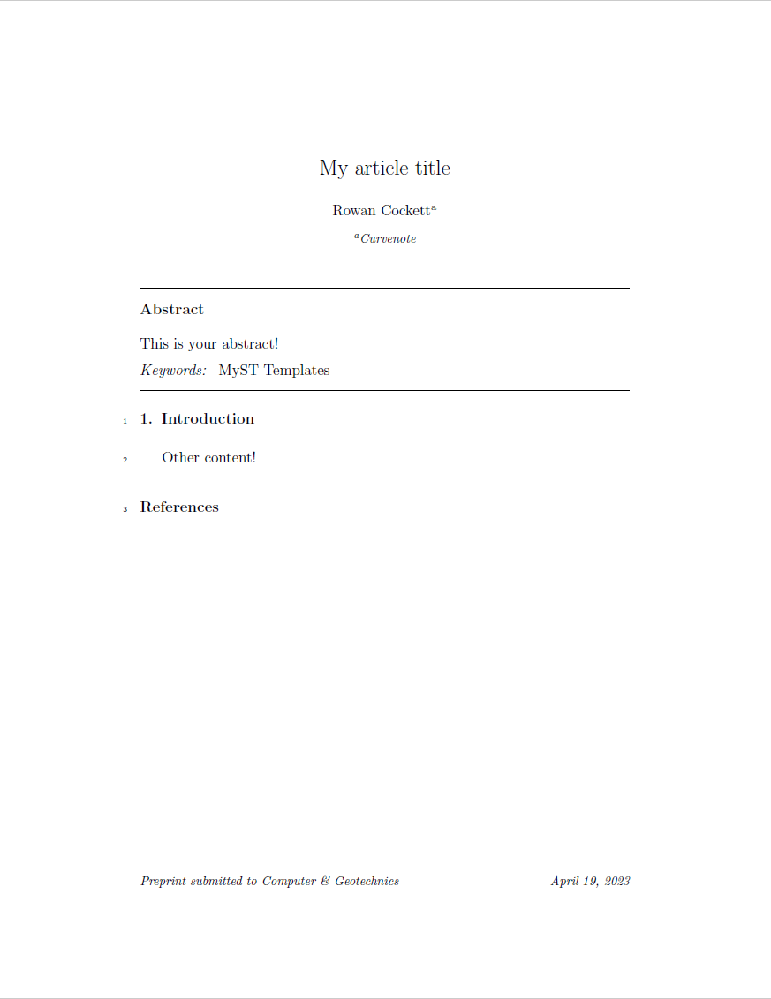

# elsarticle

elsarticle template

- Author: Elsevier
- Author Website: https://www.elsevier.com/
- [Submission Guidelines](https://www.elsevier.com/authors/policies-and-guidelines/latex-instructions)

## Usage

See [MyST Guide for creating Documents](https://myst-tools.org/docs/mystjs/quickstart-myst-documents) for instructions 
on how to set up a MyST project.

In the `elsarticle` template, the following options are available:

| Category |        Option        |   Type    | Required |       Default       | Description                                    |
|:--------:|:--------------------:|:---------:|:--------:|:-------------------:|------------------------------------------------|
| Document |       `title`        | `string`  |  `Yes`   |                     | Title of your document                         |
|          |      `authors`       |  `list`   |  `Yes`   |                     | List of authors                                |
|          |      `keywords`      | `string`  |  `Yes`   |                     | List of keywords                               |
|          |    `bibliography`    | `string`  |   `No`   |                     | Path to your bibliography file (`*.bib`)       |
| Options  |       `style`        | `boolean` |   `No`   |      `review`       | Style of your document, `preprint` or `review` |
|          |  `reference_style`   | `string`  |   `No`   |       `harv`        | Reference style, `harv`, `num-names`, or `num` | 
|          |   `other_options`    | `string`  |   `No`   |       `12pt`        | Other options for the document class           |
|          |    `journal_name`    | `string`  |   `No`   | `Nuclear Physics B` | Journal name                                   |
|          |       `lineno`       | `boolean` |   `No`   |       `false`       | Whether to show line numbers                   |
|  Parts   |      `abstract`      | `string`  |  `Yes`   |                     | Abstract of your document                      |
|          | `graphical_abstract` | `string`  |   `No`   |                     | Graphical abstract of your document            |
|          |     `highlights`     | `string`  |   `No`   |                     | Highlights of your document                    |
|          |    `availability`    | `string`  |   `No`   |                     | Data availability statement                    |
|          |  `acknowledgements`  | `string`  |   `No`   |                     | Acknowledgements                               |
|          |      `appendix`      | `string`  |   `No`   |                     | Appendix                                       |

## Steps to creating your own template!

- [x] 🆕 Create this repository. Nailed it. 🚀
- [x] 📑 Replace the `template.tex` with your existing LaTeX template/article
- [x] 👯‍♀️ Copy in any other style, definitions or images necessary for the template
- [x] 👩‍🔬 Add the files necessary into `files` list in the `template.yml` ([documentation](https://myst-tools.org/docs/mystjs/jtex/template-yml))
- [x] 🧙‍♀️ Start replacing template values with `[-options.my_value-]` and put in `[# if parts.abstract #]` conditions to toggle sections on and off ([documentation](https://myst-tools.org/docs/mystjs/jtex/template-rules))
- [x] 👩🏿‍💻 Install [jtex](https://myst-tools.org/docs/mystjs/jtex) (`npm install -g jtex`) and run `jtex check` ([documentation](https://myst-tools.org/docs/mystjs/jtex/command-line))
- [x] 🪄 Continue to improve the options in your template for `parts` and `options` ([documentation](https://myst-tools.org/docs/mystjs/jtex/document))
- [x] 💾 When ready, save your `template.yml` and run `jtex check --fix`, this will add various packages that are auto detected and fix document options ([documentation](https://myst-tools.org/docs/mystjs/jtex/command-line))
- [x] 🧪 Test with real content: `myst build my-document.md --template ../path/to/template` ([documentation](https://myst-tools.org/docs/mystjs/guide/creating-pdf-documents))
- [x] 📸 Create a `thumbnail.png` with an accurate screenshot of the template
- [ ] 🧭 Update this README, and check all values in the `template.yml`
- [ ] 🚀 Push to GitHub, and contribute to the [community templates repository](https://github.com/myst-templates/templates)
