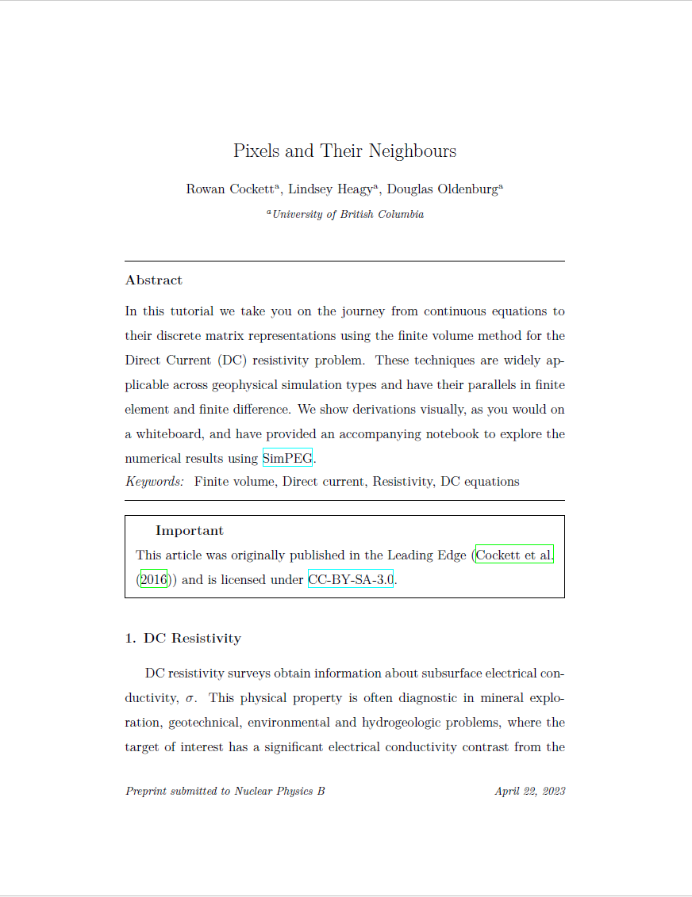

# elsarticle

elsarticle template



- Author: Elsevier
- Author Website: https://www.elsevier.com/
- [Submission Guidelines](https://www.elsevier.com/authors/policies-and-guidelines/latex-instructions)

## Usage

Clone this repository to your local machine:

```shell
git clone https://github.com/haiiliin/elsarticle.git
```

Create a new MyST Markdown document:

```shell
echo "# Document" > document.md
```

Install [MyST Markdown](https://myst-tools.org/docs/mystjs/quickstart), and then add some frontmatter:

```markdown
---
title: Title of your document
authors:
  - name: WANG Hailin
    affiliations:
      - Tongji University
      - The Hong Kong Polytechnic University
keywords: Example, Keywords
bibliography: paper.bib

exports:
  - format: pdf  # or tex to get the LaTeX source
    template: elsarticle
 
    # Options below are optional, see below for more details
    style: review
    reference_style: harv
    journal_name: Example Journal
    lineno: false
---

# Document
```

Add the `abstract`, `graphicalabstract`, and `highlights` blocks to your document:

```markdown
+++ {"part": "abstract"}
This is the abstract of my document.
+++

+++ {"part": "graphicalabstract"}
This is the graphical abstract of my document.
+++

+++ {"part": "highlights"}
This is the highlights of my document.
+++
```

## Customization

There are three types of customizations you can make to your template:

- ``document``: These are the variables set in the frontmatter of your document, 
  and are used to set basic information about your document.
- ``options``: These are the options in the `exports` section of the frontmatter, 
  and are used to set the style of your document.
- ``parts``: These are the blocks in your document, using the syntax like `+++ {"part": "abstract"} +++` (see above),
  and are used to set some special sections of your document.

In the `elsarticle` template, the following options are available:

| Category | Option              | type    | required | default           | description                                |
|----------|---------------------|---------|----------|-------------------|--------------------------------------------|
| document | `title`             | string  | true     |                   | Title of your document                     |
|          | `authors`           | list    | true     |                   | List of authors                            |
|          | `keywords`          | list    | true     |                   | List of keywords                           |
|          | `bibliography`      | string  | false    |                   | Path to your bibliography file (*.bib)     |
| options  | `style`             | boolean | false    | review            | Style of your document, preprint or review |
|          | `reference_style`   | string  | false    | harv              | Reference style, harv, num-names, or num   | 
|          | `journal_name`      | string  | false    | Nuclear Physics B | Journal name                               |
|          | `lineno`            | boolean | false    | false             | Whether to show line numbers               |
| parts    | `abstract`          | string  | true     |                   | Abstract of your document                  |
|          | `graphicalabstract` | string  | true     |                   | Graphical abstract of your document        |
|          | `highlights`        | string  | true     |                   | Highlights of your document                |

To build your PDF:

```shell
myst build --pdf
```

See [MyST Guide for creating Documents](https://myst-tools.org/docs/mystjs/quickstart-myst-documents) for full instructions.

## Steps to creating your own template!

- [x] 🆕 Create this repository. Nailed it. 🚀
- [x] 📑 Replace the `template.tex` with your existing LaTeX template/article
- [x] 👯‍♀️ Copy in any other style, definitions or images necessary for the template
- [x] 👩‍🔬 Add the files necessary into `files` list in the `template.yml` ([documentation](https://myst-tools.org/docs/mystjs/jtex/template-yml))
- [x] 🧙‍♀️ Start replacing template values with `[-options.my_value-]` and put in `[# if parts.abstract #]` conditions to toggle sections on and off ([documentation](https://myst-tools.org/docs/mystjs/jtex/template-rules))
- [x] 👩🏿‍💻 Install [jtex](https://myst-tools.org/docs/mystjs/jtex) (`npm install -g jtex`) and run `jtex check` ([documentation](https://myst-tools.org/docs/mystjs/jtex/command-line))
- [x] 🪄 Continue to improve the options in your template for `parts` and `options` ([documentation](https://myst-tools.org/docs/mystjs/jtex/document))
- [x] 💾 When ready, save your `template.yml` and run `jtex check --fix`, this will add various packages that are auto detected and fix document options ([documentation](https://myst-tools.org/docs/mystjs/jtex/command-line))
- [x] 🧪 Test with real content: `myst build my-document.md --template ../path/to/template` ([documentation](https://myst-tools.org/docs/mystjs/guide/creating-pdf-documents))
- [x] 📸 Create a `thumbnail.png` with an accurate screenshot of the template
- [ ] 🧭 Update this README, and check all values in the `template.yml`
- [ ] 🚀 Push to GitHub, and contribute to the [community templates repository](https://github.com/myst-templates/templates)
